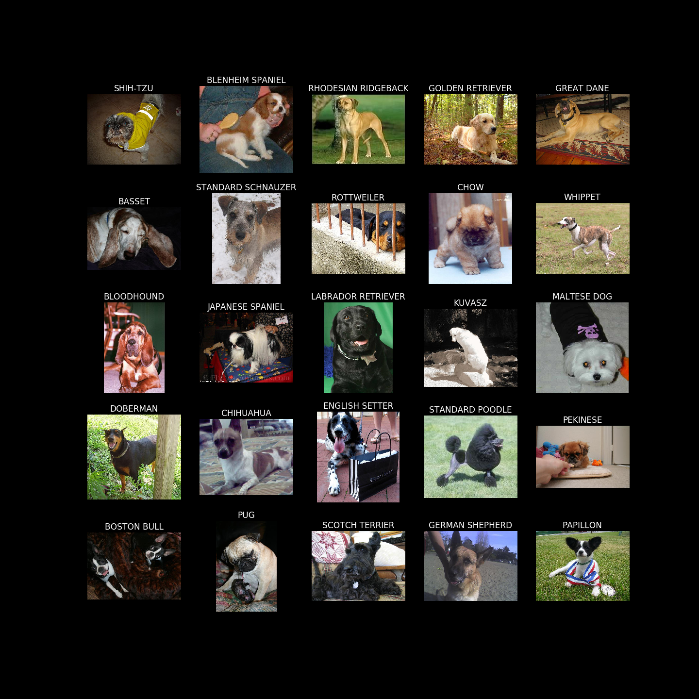
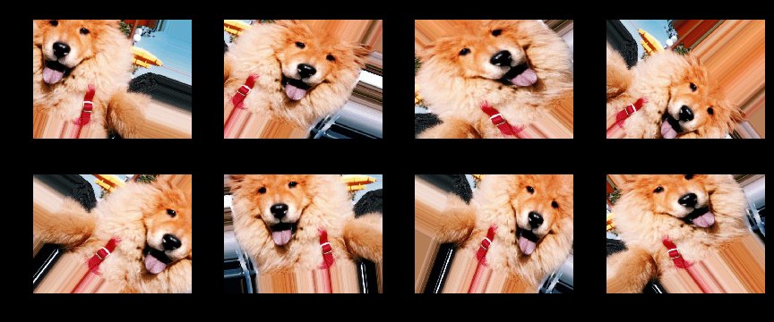

# Who's Your Doggy

## Motivation

Dogs have been artificially bred by humans over the years to highlight desirable work and pet qualities. Due to the multitude of purposes, dogs have become the most diverse species on the planet.

The day you bring home your furry ball of love from the animal shelter is typically exciting and full of joy, however, the return rate back to the shelter can vary between 5 and 20%. The most common reasons why a dog may be returned are unexpected costs, human health issues, and a variety unwanted behaviors. Doing some reasearch about the personality and behaviors you are looking for can help prepare you for your shelter visit, however, coming home with a miss classified mixed breed is highly likely due to dog breed diverstiy. 

Personally, classifying my own rez dog with more accurate breeds than the generic, "Australian Shepherd Mix", is my personal motivation for the beginning of the project. 

## About the data:

This set of images comes from the well known <a href = "http://vision.stanford.edu/aditya86/ImageNetDogs/">Standford Dog dataset</a>

The data contains the following:

    120 dog breeds
    ~150 images per breed
    Total images: 20,580
   
Due to imense ammount of dog classifications, I started initially with only five random breeds and eventually utilized a total of 25 breeds with wich to work. 

The final 25 breeds I chose to classify are: 

## Machine Learning Modeling with CNN

### Image Data Generator for Training

Before training a model, we have to determine what information we want it to learn. Utilizing an ImageDataGenerator, I generated batches of augmented images that look similar to the following:

Changing the aspects of the image gives the machine learning model more of an opportunity to find dynamic features within the dog that are not particular to the area that feature occures within the picture itself. 

### Baseline CNN

### Transfer Learning

#### Model Comparisons

#### Final Optimized Xception

