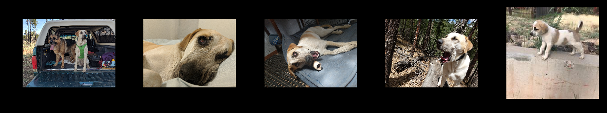

# Who's Your Doggy

## Motivation

Dogs have been artificially bred by humans over the years to highlight desirable work and pet qualities. Due to the multitude of purposes, dogs have become the most diverse species on the planet.

The day you bring home your furry ball of love from the animal shelter is typically exciting and full of joy, however, the return rate back to the shelter can vary between 5 and 20%. The most common reasons why a dog may be returned are unexpected costs, human health issues, and a variety unwanted behaviors. Doing some research about the personality and behaviors you are looking for can help prepare you for your shelter visit, however, coming home with a miss classified mixed breed is highly likely due to dog breed diversity. 

Personally, classifying my own rez-dog with more accurate breeds than the generic, "Australian Shepherd Mix", is my personal motivation for the beginning of the project. 

## About the data:

This set of images comes from the well known <a href = "http://vision.stanford.edu/aditya86/ImageNetDogs/">Standford Dog dataset</a>

The data contains the following:

    120 dog breeds
    ~150 images per breed
    Total images: 20,580

Due to immense amount of dog classifications, I started initially with only five random breeds and eventually utilized a total of 25 breeds with which to work. 

The final 25 breeds I chose to classify are: 

## Modeling 

I began the project with a very basic Convolutional Nerual Network. 
The Architecture of this basic CNN involved a series of r convolutional, pooling and activation layers. To end the process, a flatten, dense, dropout and final activation layer to show the model to produce 25 different predictions, one for each breed. 

The Image below gives a quick example of how the model reviews the input vectorized image to learn important features

### Image Augmentation

Before throwing images into the convolutional neural network; performing some image augmentation is essential. Not only does this provide you with increased data with which to train, but it allows your model to do a better job at generalizing the dog's important features. 

The image above shows an example of the types of image augmentations I utilized. 

* Rotation
* Shift width & height
* Zoom in & out
* Horizontal flips
* Fill with 'nearest' color

### Baseline CNN

This basic Convolutional Neural network had a great start to its performance. The accuracy was increasing and the loss was going down at great rates and could eventually be optimized through more layers and much more training.  

However, a quicker method to gaining better accuracy scores quicker is the move toward transfer learning. 

### Transfer Learning
Through little effort but much patience, training the model, Xception with a high learning rate of 0.1 and using only 15 trainable layers, the progress in the training/validation accuracies below show why this new method would produce better results in a more timely fashion.

#### Model Progress

Over the course of the entire project, I began with my basic CNN, gaining a low accuracy of about 15%. Overall, trying out different transfer learning models like VGG16 and ResNet, I settled on focusing all of my energy on optimizing the Xception model. 

### Final Xception Model

The final model had a total of 54 trainable layers, unfreezing 10 at a time and training on 20 - 100 epochs for each unfreeze. I also finalized my optimization function Nadam with a final learning rate of 0.001. This model had a total of 131 layers including the pre-weighted "bottom" of the original ImageNet weights. 

The image examples below give an idea of what the dog pictures look like at varying layers. By only layer 30 they are almost unrecognizable to the human eye and certainly by layer 131 there are only a few distinct pixelated colors available. 

##### *Activation Layer 1*

##### *Activation Layer 10*

##### *Activation Layer 20*

##### *Activation Layer 30*

### Final Predictions

The five hilighted values between 0 and 1 are the five incorrect classifications on m 185 validation set. Noting the differneces in the actual and predicted animals below shows the hilight on what areas the model is focusing on. 

#### Determine Rees' Breeds
Utilizing 27 pictures of my mixed breed pup, I found her top 5 breed categories according to my model and here are the results. 

Labrador Retriever               Whippet                     Pug                  Basset Hound             Bloodhound

I am interested in seeing if I added more breeds with dark facial features, if Pug would still be in her top five. That was the only surprise in her possible breed profile.

#### Further Directions with this Model

I would Love to create a flask app to classify other mutts like mine based on visual or a similar dog recommender. 